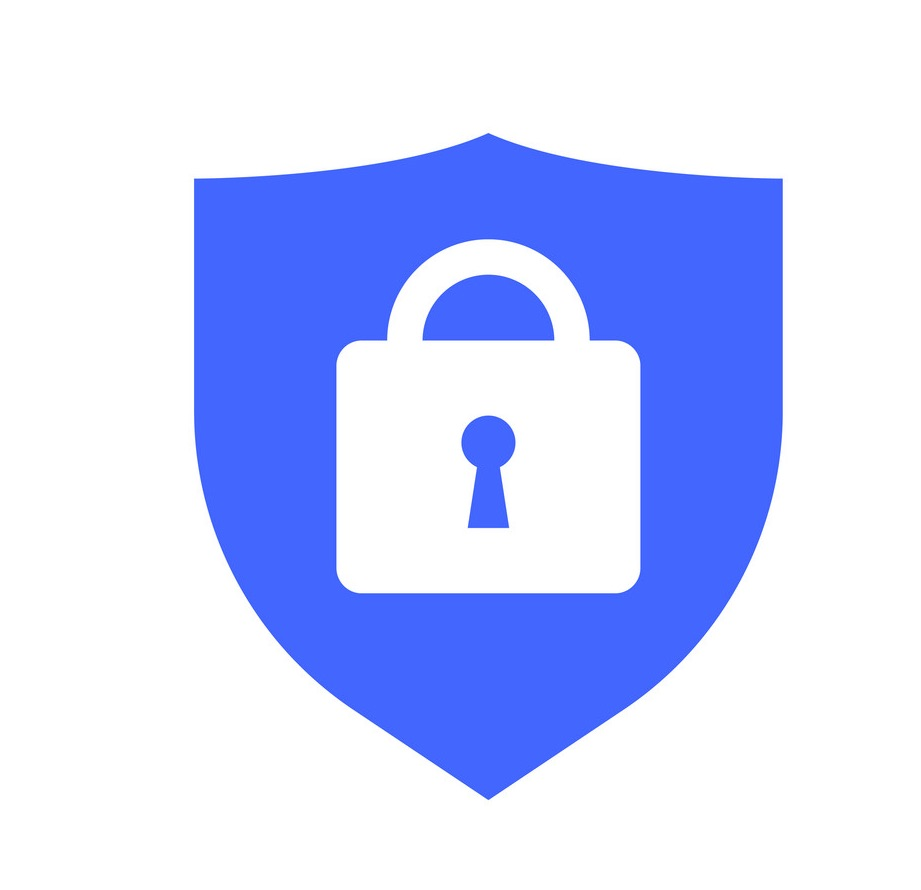
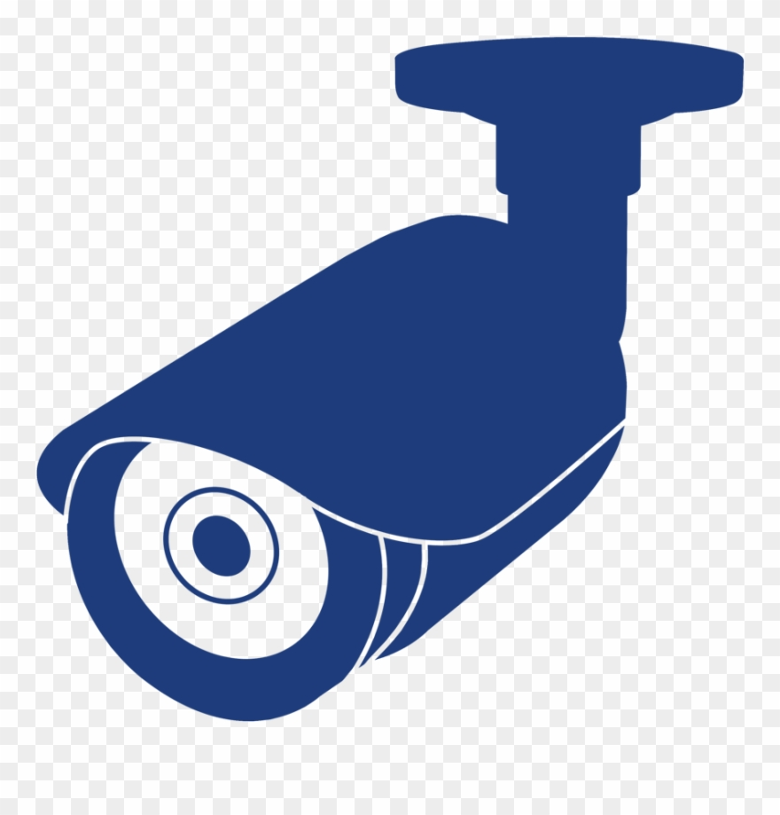

### Abstraction
This document explains the security measurements in place with iam-manager solution in AWS use case.

#### Security:
To manage IAM role lifecycle independently, controller(Pod) needs to have AWS IAM access to create/update/delete role which is a security concern if solution is not designed properly but thanks to AWS IAM Permission Boundaries which got released in Q3 2018 and we can restrict the permissions on what user/role can do even if they have iam.* access. 
To have more confidence in terms of security, any good design should consider implementing Proactive and Reactive security measurements.

##### Proactive measurements:   

###### Kubernetes validation web hook implementation

 Kubernetes web hook validation comes in very handy if we want to validate user input before inserting into persistence system(etcd). This allows us to implement following actions and reject the request if it violates the defined policy.  
      i. Allow IAM Role creation only with "pre-defined IAM whitelisted policies"  
     ii. Allow only ONE role per namespace  
     
###### IAM Permission Boundaries

Another important security concern is having an aws iam write access to the controller itself. This is important for many reasons where an developer/hacker gets an access to controller pod (which is very unlikely, if we say this is possible than we have a bigger thing to worry about where developers having an access to resources in a different namespace. We are not talking about cluster admins here. well, cluster admin can delete the entire cluster) and start creating/deleting the roles which are not part of the Kubernetes environment (For ex: PowerUser). This is where IAM Permission Boundaries, Controlling Access Using Tags comes into picture. 

 In brief, If we define a permission boundary with "s3.Get*" access, any role created by controller pod can get only s3.Get access even if new role has an "Administrative" policy with full access attached. For more details, please refer the IAM Permission Boundaries.

That being said, iam role attached to controller can do only following actions
      i. Can create roles only with pre-defined syntax.
     ii. Can not create a role with out providing pre-defined permission boundary name.
    iii. Can not delete any role which adheres to pre-defined syntax.
     iv. Can not delete any role which doesn't have a pre-defined TAG. (We will attach the tag only to the roles created by controller pod)

###### Do not provide an option to users to provide IAM role name
 Role name can be constructed based on the namespace where custom resource is being created. This allows us to create IAM role with consistent naming conventions.

###### Custom resource controller deployed in its own namespace.
This is the recommended approach to deploy a CRD in Kubernetes. This allows us to define specific RBAC to the this namespace and also restricting other namespace users to accessing the controller pod.

##### Reactive measurements:  

###### Remediate action triggered by  AWS cloud watch rule

For some reason, if any role got created by controller pod with malicious intent(Having a different IAM policies than the pre-defined whitelisted IAM policies) we want to make sure remediate action plan is in place. Cloud watch rule which can trigger a lambda function if it detects any action(create/update/delete and even attaching a policy api call) taken by controller pod IAM role, lambda function verifies that action was taken by "within the known limits" and if it detects any anomaly it simply attaches "Deny" all access so that role can not be used for anything.

For more details: Please refer https://github.intuit.com/keikoproj/iam-manager-monitor/ repo for sample app

Finally, with all the measurements in place controller pod can do only do limited actions which can be totally pre-defined   

### Pros:
1. Solution is completely de-centralized and there are no outbound calls from the cluster.   
2. More secure with the Permission Boundary.   
3. Not customized solution for Intuit which means this can be distributed as open source project.   
4. Auditing information is available with CloudTrail.   
5. If there is any breach, ONLY clusters in this particular account gets compromised compared to ALL the clusters if iam is managed in central place.   
### Cons:
1. Solution must be carefully implemented.  
2. If there is any breach, clusters in this particular account gets compromised.