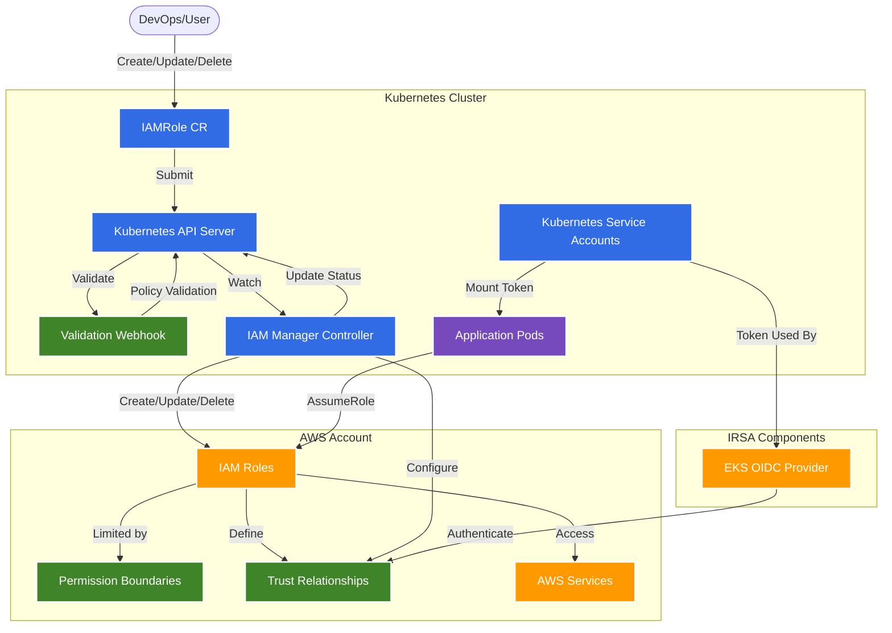

# IAM Manager Architecture

This document provides an overview of the IAM Manager architecture and its interaction with Kubernetes and AWS components.

## Architecture Diagram

## Component Descriptions

### Kubernetes Components

- **IAMRole CR**: Custom Resource that defines the desired IAM role configuration
- **Validation Webhook**: Ensures IAM policies comply with allowed policies and resource limits
- **IAM Manager Controller**: Reconciles IAMRole CRs with actual AWS IAM roles
- **Service Accounts**: Kubernetes identities that can be associated with IAM roles (IRSA)
- **Application Pods**: Workloads that use IAM roles to access AWS services

### AWS Components

- **IAM Roles**: AWS Identity & Access Management roles created and managed by the controller
- **Permission Boundaries**: Limit the maximum permissions that can be granted to roles
- **Trust Relationships**: Define which entities can assume the roles
- **AWS Services**: Cloud services accessed using the IAM roles

### IRSA Components

- **EKS OIDC Provider**: Allows Kubernetes service accounts to authenticate to AWS and assume IAM roles

## Workflows

1. **Creation Flow**:
   - User creates an IAMRole CR in a Kubernetes namespace
   - Webhook validates the policy against allowed actions and resources
   - Controller creates an AWS IAM role with permission boundary
   - Status is updated with the role ARN and creation state

2. **IRSA Flow**:
   - IAMRole CR includes a service account annotation
   - Controller configures the trust policy to allow the service account to assume the role
   - Pods using the service account can access AWS resources via the role

3. **Security Controls**:
   - Permission boundaries limit the maximum permissions
   - Namespace-level role restrictions control proliferation of roles
   - Validation webhooks prevent creation of overly permissive policies
